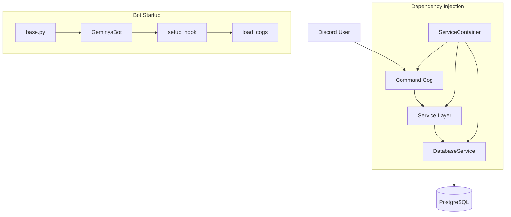

# NWNL Command Architecture Guide

This document describes the architecture of the NWNL (waifu gacha) command system in Geminya. Use this as a reference for creating a new gamemode based on the existing pattern.

---

## High-Level Architecture



---

## Directory Structure

```
cogs/
├── __init__.py           # Exports COMMANDS list
├── base_command.py       # BaseCommand class with DI
├── commands/
│   ├── __init__.py       # Auto-discovers all command modules
│   ├── waifu_summon.py   # NWNL gacha/summon commands
│   ├── waifu_academy.py  # NWNL status/daily/missions
│   ├── shop.py           # NWNL shop/inventory system
│   ├── expeditions.py    # Expedition gamemode (example)
│   └── world_threat.py   # World Threat gamemode (example)

services/
├── container.py          # ServiceContainer - DI hub
├── database.py           # DatabaseService - all DB operations
├── waifu_service.py      # NWNL business logic
├── expedition_service.py # Expedition business logic
└── world_threat_service.py # World Threat business logic
```

---

## Layer 1: Command Cog

### Location
`cogs/commands/<your_gamemode>.py`

### Base Class
All command cogs inherit from `BaseCommand`:

```python
from cogs.base_command import BaseCommand
from services.container import ServiceContainer

class YourGamemodeCog(BaseCommand):
    def __init__(self, bot: commands.Bot, services: ServiceContainer):
        super().__init__(bot, services)
        # Access services via self.services
        # Access database via self.services.database
        # Access waifu service via self.services.waifu_service
```

### Key Inherited Attributes
| Attribute | Description |
|-----------|-------------|
| `self.bot` | Discord bot instance |
| `self.services` | ServiceContainer with all services |
| `self.config` | Bot configuration |
| `self.state_manager` | User state management |
| `self.ai_service` | AI/LLM service |
| `self.logger` | Logger for this cog |

### Command Queuing
Use `queue_command()` to ensure sequential per-user execution and block banned users:

```python
@commands.hybrid_command(
    name="nwnl_status", 
    description="📊 Check your academy status"
)
async def nwnl_status(self, ctx: commands.Context):
    """Display user's academy status."""
    return await self.queue_command(ctx, self._nwnl_status_impl)

async def _nwnl_status_impl(self, ctx: commands.Context):
    """Implementation of nwnl_status command."""
    # Your actual command logic here
    user_id = str(ctx.author.id)
    status = await self.services.waifu_service.get_user_stats(user_id)
    # Build embed and respond
```

### Command Naming Convention
All NWNL commands use the `nwnl_` prefix:
- `/nwnl_summon` - Single summon
- `/nwnl_multi_summon` - 10-pull summon
- `/nwnl_status` - Check status
- `/nwnl_daily` - Daily rewards

### Setup Function
Every cog file **must** have a `setup()` function:

```python
async def setup(bot: commands.Bot):
    """Setup function for the cog."""
    await bot.add_cog(YourGamemodeCog(bot, bot.services))
```

---

## Layer 2: Service Layer

### Location
`services/<your_service>.py`

### Purpose
Contains all **business logic**, decoupled from Discord-specific code.

### Pattern
```python
from services.database import DatabaseService

class YourGamemodeService:
    def __init__(self, database: DatabaseService):
        self.db = database
        self.logger = logging.getLogger(__name__)
    
    async def initialize(self):
        """Called by ServiceContainer.initialize_all()"""
        pass
    
    async def close(self):
        """Called by ServiceContainer.cleanup_all()"""
        pass
    
    async def some_business_logic(self, discord_id: str, ...):
        """Your gamemode logic here."""
        # Call database methods
        user = await self.db.get_or_create_user(discord_id)
        # Process business rules
        # Return results
```

### Registering the Service
Add to `services/container.py`:

```python
from services.your_service import YourGamemodeService

class ServiceContainer:
    def __init__(self, config: Config):
        # ... existing services ...
        self.your_service = YourGamemodeService(self.database)
    
    async def initialize_all(self):
        # ... existing init ...
        await self.your_service.initialize()
    
    async def cleanup_all(self):
        # ... existing cleanup ...
        await self.your_service.close()
    
    def get_your_service(self) -> YourGamemodeService:
        return self.your_service
```

---

## Layer 3: Database Layer

### Location
`services/database.py`

### Key Methods for NWNL

| Method | Description |
|--------|-------------|
| `get_or_create_user(discord_id)` | Get/create user account |
| `get_user_waifus(discord_id)` | Get user's waifu collection |
| `add_user_waifu(discord_id, waifu_id, star_level)` | Add waifu to collection |
| `update_user_currency(discord_id, currency, amount)` | Update currency |
| `get_user_inventory(discord_id)` | Get inventory items |

### Creating New Database Methods

```python
async def your_new_method(self, discord_id: str, ...) -> Optional[Dict]:
    """Description of what this does."""
    async with self.connection_pool.acquire() as conn:
        result = await conn.fetchrow("""
            SELECT * FROM your_table
            WHERE discord_id = $1
        """, discord_id)
        return dict(result) if result else None
```

---

## Auto-Discovery of Cogs

### How It Works
1. `cogs/commands/__init__.py` uses `pkgutil.iter_modules()` to discover all `.py` files
2. `base.py` → `GeminyaBot.setup_hook()` loads all cogs from `COMMANDS` list
3. Each cog's `setup()` function registers it with the bot

```python
# cogs/commands/__init__.py
from pkgutil import iter_modules

COMMANDS = [module.name for module in iter_modules(__path__, f"{__package__}.")]
```

### Adding a New Cog
Simply create `cogs/commands/your_gamemode.py` - it will be **automatically discovered** and loaded!

---

## UI Patterns

### Discord Views (Buttons/Selects)
Each gamemode uses `discord.ui.View` for interactive elements:

```python
class YourPaginatedView(discord.ui.View):
    def __init__(self, data, ctx, timeout=180):
        super().__init__(timeout=timeout)
        self.data = data
        self.ctx = ctx
        self.page = 0
    
    def get_embed(self):
        """Build embed for current page."""
        # Return discord.Embed
    
    async def interaction_check(self, interaction: discord.Interaction):
        return interaction.user.id == self.ctx.author.id
    
    @discord.ui.button(label="◀️", style=discord.ButtonStyle.secondary)
    async def prev_page(self, interaction, button):
        self.page = max(0, self.page - 1)
        await interaction.response.edit_message(embed=self.get_embed(), view=self)
    
    @discord.ui.button(label="▶️", style=discord.ButtonStyle.secondary)
    async def next_page(self, interaction, button):
        self.page += 1
        await interaction.response.edit_message(embed=self.get_embed(), view=self)
```

---

## Checklist for New Gamemode

### Files to Create
- [ ] `cogs/commands/<gamemode>.py` - Command cog
- [ ] `services/<gamemode>_service.py` - Business logic service

### Files to Modify
- [ ] `services/container.py` - Register your service
- [ ] `services/database.py` - Add database methods (if new tables needed)

### Database Tables (Optional)
Create migration scripts in `migrations/` if you need new tables.

---

## Example: Minimal Gamemode Skeleton

### `cogs/commands/my_game.py`
```python
"""My Game Discord commands."""

import discord
from discord.ext import commands
from cogs.base_command import BaseCommand
from services.container import ServiceContainer


class MyGameCog(BaseCommand):
    def __init__(self, bot: commands.Bot, services: ServiceContainer):
        super().__init__(bot, services)
    
    @commands.hybrid_command(
        name="mygame_start",
        description="🎮 Start a new game"
    )
    async def mygame_start(self, ctx: commands.Context):
        return await self.queue_command(ctx, self._mygame_start_impl)
    
    async def _mygame_start_impl(self, ctx: commands.Context):
        user_id = str(ctx.author.id)
        # Call your service
        result = await self.services.my_game_service.start_game(user_id)
        
        embed = discord.Embed(
            title="🎮 Game Started!",
            description=f"Your game has begun!",
            color=discord.Color.green()
        )
        await ctx.send(embed=embed)


async def setup(bot: commands.Bot):
    await bot.add_cog(MyGameCog(bot, bot.services))
```

### `services/my_game_service.py`
```python
"""My Game business logic service."""

import logging
from typing import Dict, Any
from services.database import DatabaseService


class MyGameService:
    def __init__(self, database: DatabaseService):
        self.db = database
        self.logger = logging.getLogger(__name__)
    
    async def initialize(self):
        self.logger.info("MyGameService initialized")
    
    async def close(self):
        self.logger.info("MyGameService closed")
    
    async def start_game(self, discord_id: str) -> Dict[str, Any]:
        user = await self.db.get_or_create_user(discord_id)
        # Your game logic here
        return {"status": "started", "user": user}
```

---

## Reference: Existing NWNL Commands

### Summon Commands (`waifu_summon.py`)
| Command | Description |
|---------|-------------|
| `nwnl_summon` | Single waifu summon |
| `nwnl_multi_summon` | 10-pull summon |
| `nwnl_collection` | View collection |
| `nwnl_collection_list` | Paginated collection |
| `nwnl_profile` | Waifu details |
| `nwnl_database` | Browse all waifus |
| `nwnl_series_id` | View series by ID |

### Academy Commands (`waifu_academy.py`)
| Command | Description |
|---------|-------------|
| `nwnl_status` | Academy status/stats |
| `nwnl_daily` | Claim daily rewards |
| `nwnl_missions` | View daily missions |
| `nwnl_rename_academy` | Rename academy |
| `nwnl_reset_account` | Reset account |
| `nwnl_delete_account` | Delete account |
| `nwnl_collection_search` | Search/filter collection |

### Shop Commands (`shop.py`)
| Command | Description |
|---------|-------------|
| `nwnl_shop` | Browse shop |
| `nwnl_buy` | Purchase items |
| `nwnl_inventory` | View inventory |
| `nwnl_use_item` | Use items |
| `nwnl_purchase_history` | History |

---

## Key Design Principles

1. **Separation of Concerns**: Discord UI in Cogs, logic in Services, data in Database
2. **Dependency Injection**: All dependencies flow through `ServiceContainer`
3. **Command Queuing**: Use `queue_command()` for sequential per-user execution
4. **Auto-Discovery**: New cogs are automatically loaded
5. **Hybrid Commands**: Use `@commands.hybrid_command` for both slash and text commands
